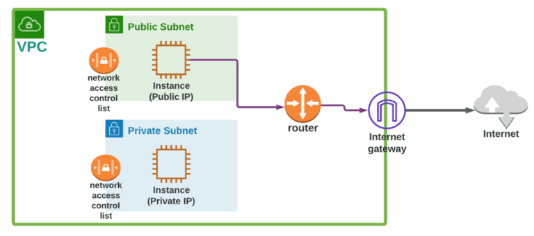

# Amazon VPC (Virtual Private Cloud) Overview 🌐

Amazon VPC (Virtual Private Cloud) is a service that allows you to provision a logically isolated section of the AWS Cloud where you can launch AWS resources in a virtual network that you define. 

## Key Features

- *Isolation*: Isolate your network from other networks in AWS.
- *Customizable Network*: Create your own private IP address range, subnets, route tables, and network gateways.
- *Security*: Implement security groups and network ACLs to control inbound and outbound traffic.
- *Connectivity*: Connect your VPC to the internet or to your own data center.

## Core Components

1. *Subnets*: Segments within your VPC that allow you to partition your network.
2. *Route Tables*: Define the routes for traffic within and outside the VPC.
3. *Internet Gateway*: Enables communication between your VPC and the internet.
4. *NAT Gateway*: Allows instances in a private subnet to connect to the internet while remaining unreachable from the outside.
5. *VPC Peering*: Allows you to connect multiple VPCs.
6. *Security Groups*: Virtual firewalls that control inbound and outbound traffic.
7. *Network ACLs*: Stateless filters for controlling traffic at the subnet level.

## Diagram

