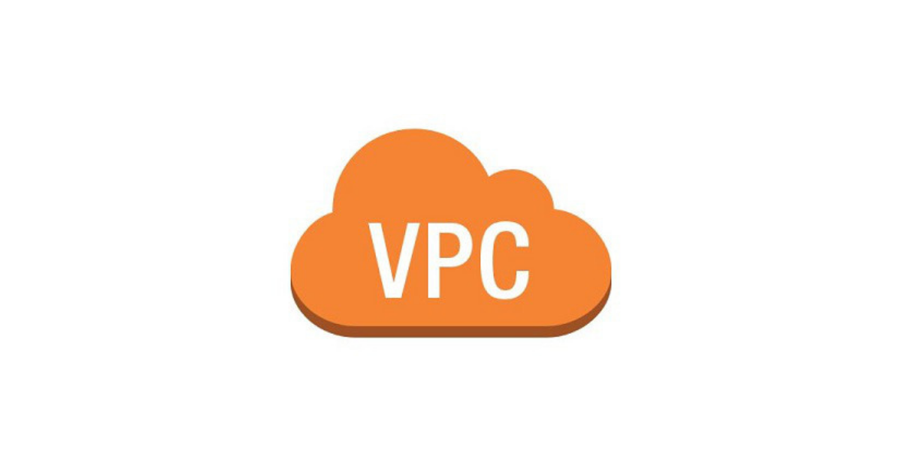

# AWS VPC (Virtual Private Cloud) Notes 📘

Welcome to the AWS VPC notes repository! This folder contains detailed notes and examples to help you understand and configure Amazon VPC effectively. 

## Folder Contents

- **[VPC Overview](./Overview.md)**: Provides an overview of Amazon VPC, its purpose, and core features. 🌐
- **[VPC Components](./Components.md)**: Describes the key components of a VPC, including subnets, route tables, and security features. 🧩
- **[VPC Configuration](./Configuration.md)**: Step-by-step instructions for setting up and configuring a VPC. 🛠️
- **[VPC UseCases](./UseCases.md)**: Various use cases illustrating how VPC can be utilized for different scenarios. 📚

## Getting Started

1. *Read Overview.md* to get a high-level understanding of Amazon VPC.
2. *Check Components.md* to learn about the different elements of a VPC and their roles.
3. *Follow Configuration.md* to set up your VPC step-by-step.
4. *Explore UseCases.md* for practical applications and scenarios where VPC can be used effectively.
5. *Refer to Examples.md* for CloudFormation templates and practical examples.

Feel free to contribute by adding more examples or use cases, or by improving the existing notes!